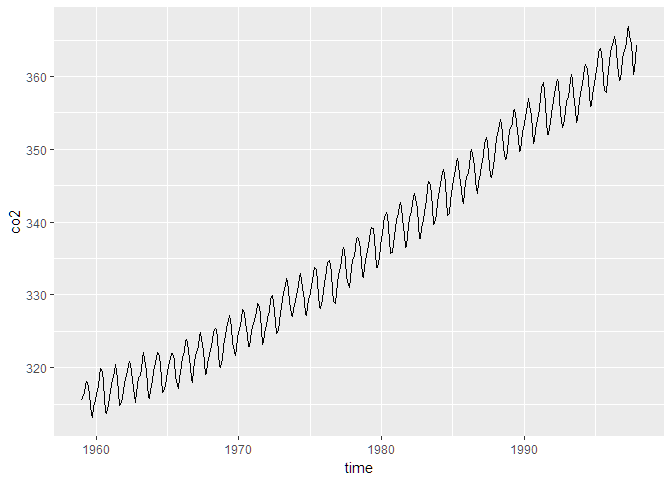

Woe is a me bop om drop a re bop om


```r
library(tidyverse)
```

```
## -- Attaching packages ---------------------------------------------------------- tidyverse 1.2.1 --
```

```
## v ggplot2 2.2.1.9000     v purrr   0.2.4     
## v tibble  1.4.1          v dplyr   0.7.4     
## v tidyr   0.7.2          v stringr 1.2.0     
## v readr   1.1.1          v forcats 0.2.0
```

```
## Warning: package 'tibble' was built under R version 3.4.3
```

```
## -- Conflicts ------------------------------------------------------------- tidyverse_conflicts() --
## x dplyr::filter() masks stats::filter()
## x dplyr::lag()    masks stats::lag()
```

```r
foo <- readRDS("C:/Users/bk6014/OneDrive - Cerner Corporation/RWD/learningR2/data/co2.Rds")
head(foo)
```

```
##   X     time    co2
## 1 1 1959.000 315.42
## 2 2 1959.083 316.31
## 3 3 1959.167 316.50
## 4 4 1959.250 317.56
## 5 5 1959.333 318.13
## 6 6 1959.417 318.00
```

```r
p <- ggplot(foo, aes(x=time, y=co2)) + geom_line()
print(p)
```

<!-- -->

The end

---
title: "foo.R"
author: "BK6014"
date: "Wed Jan 24 12:36:32 2018"
---
